# Monarch Meshes: Complete Guide

## Table of Contents
1. [Introduction](#introduction)
2. [What is a Mesh?](#what-is-a-mesh)
3. [Types of Meshes](#types-of-meshes)
4. [Mesh Hierarchy](#mesh-hierarchy)
5. [Mesh Operations](#mesh-operations)
6. [Distributed Patterns](#distributed-patterns)
7. [Best Practices](#best-practices)

---

## Introduction

Meshes are the organizational backbone of Monarch. They provide a structured way to organize and manage hosts, processes, and actors across distributed systems. This document provides a comprehensive guide to understanding and using all types of meshes in Monarch.

---

## What is a Mesh?

### Definition

A **Mesh** in Monarch is a multidimensional container that organizes computational resources. Meshes can contain:
- Hosts (physical or virtual machines)
- Processes (OS-level processes)
- Actors (computation units)

### Core Properties

```mermaid
graph TD
    M[Mesh] --> D[Multidimensional]
    M --> N[Named Dimensions]
    M --> S[Sliceable]
    M --> B[Broadcast-capable]

    D --> D1["hosts: 32"]
    D --> D2["gpus: 8"]

    style M fill:#2F4F4F,stroke:#333,stroke-width:2px
    style D fill:#F8F8FF
    style N fill:#F8F8FF
    style S fill:#F8F8FF
    style B fill:#F8F8FF
```

**1. Multidimensional Structure**
- Organized along named axes (dimensions)
- Each dimension has a size
- Creates a logical coordinate system

**2. Named Dimensions**
- Dimensions have semantic names (e.g., "hosts", "gpus")
- Makes code more readable and maintainable
- Enables dimension-aware slicing

**3. Extent**
- The "shape" of a mesh
- Dictionary mapping dimension names to sizes
- Example: `{"hosts": 32, "gpus": 8}` = 256 total elements

**4. Hierarchical**
- Meshes spawn other meshes
- Forms a tree structure
- Enables resource organization

---

## Types of Meshes

Monarch provides three types of meshes, forming a hierarchy:

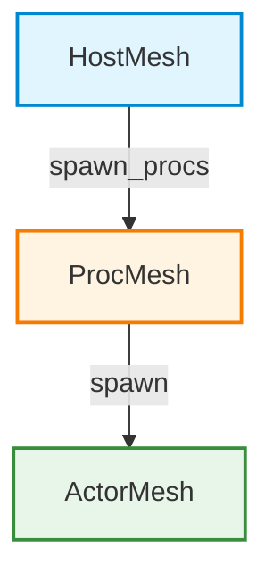

### 1. HostMesh

**Purpose:** Represents a collection of compute hosts (machines/nodes).

**Characteristics:**
- Top-level mesh
- Represents physical/virtual machines
- Spawns processes on hosts
- Manages resource allocation

**Structure Diagram:**

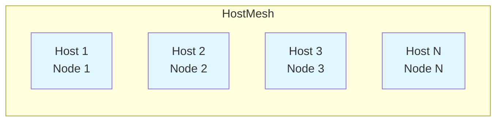

**Common Operations:**
```python
from monarch.actor import hosts_from_config, this_host

# Get hosts from scheduler config
hosts = hosts_from_config("MONARCH_HOSTS")
print(hosts.extent)  # {"hosts": 32}

# Or use current host for development
host = this_host()
print(host.extent)  # {"hosts": 1} or unity

# Spawn processes on hosts
procs = hosts.spawn_procs(per_host={"gpus": 8})
```

**Dimension Examples:**
```python
# Single dimension
hosts = HostMesh(extent={"hosts": 16})

# Multiple dimensions (rare for HostMesh)
hosts = HostMesh(extent={"racks": 4, "hosts_per_rack": 8})
```

### 2. ProcMesh

**Purpose:** A distributed mesh of OS processes for actor computation.

**Characteristics:**
- Middle layer in hierarchy
- One process typically per GPU/CPU core
- Spawns actors
- Can activate for distributed tensors

**Structure Diagram:**

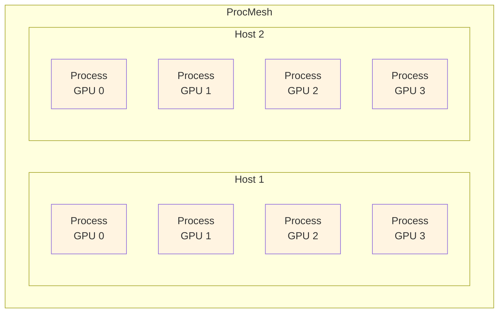

**Common Operations:**
```python
# Create from host mesh
hosts = this_host()
procs = hosts.spawn_procs(per_host={"gpus": 8})
print(procs.extent)  # {"gpus": 8}

# Multiple hosts
hosts = hosts_from_config("MONARCH_HOSTS")  # 32 hosts
procs = hosts.spawn_procs(per_host={"gpus": 8})
print(procs.extent)  # {"hosts": 32, "gpus": 8}

# Spawn actors on processes
actors = procs.spawn("actors", MyActor, init_args)

# Activate for distributed tensors
with procs.activate():
    tensor = torch.rand(100, 100)  # Distributed
```

**Dimension Examples:**
```python
# Single host, multiple GPUs
procs = this_host().spawn_procs(per_host={"gpus": 8})
# extent: {"gpus": 8}

# Multiple hosts, multiple GPUs per host
procs = hosts.spawn_procs(per_host={"gpus": 8})
# extent: {"hosts": 32, "gpus": 8}

# Custom dimensions
procs = hosts.spawn_procs(per_host={"workers": 16})
# extent: {"hosts": 32, "workers": 16}
```

### 3. ActorMesh

**Purpose:** A collection of actor instances organized in a mesh.

**Characteristics:**
- Bottom layer in hierarchy
- Contains actual actor instances
- Inherits dimensions from ProcMesh
- Supports all messaging adverbs

**Structure Diagram:**

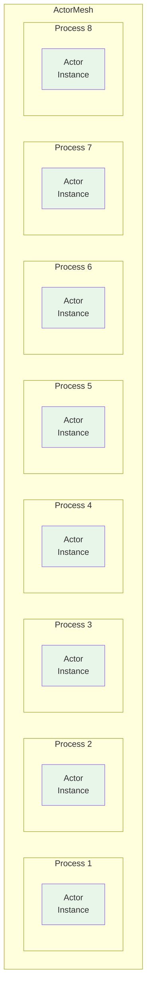

**Common Operations:**
```python
# Create from ProcMesh
actors = procs.spawn("actors", MyActor, init_args)
print(type(actors))  # ActorMesh
print(actors.extent)  # Same as procs.extent

# Call endpoints
results = actors.method.call(args).get()

# Broadcast
actors.method.broadcast(args)

# Slice
subset = actors.slice(gpus=slice(0, 4))
```

**Dimension Examples:**
```python
# Inherits from ProcMesh
procs = this_host().spawn_procs(per_host={"gpus": 8})
actors = procs.spawn("actors", MyActor)
# actors.extent: {"gpus": 8}

# Multi-dimensional
procs = hosts.spawn_procs(per_host={"gpus": 8})
actors = procs.spawn("actors", MyActor)
# actors.extent: {"hosts": 32, "gpus": 8}
```

---

## Mesh Hierarchy

### Complete Hierarchy

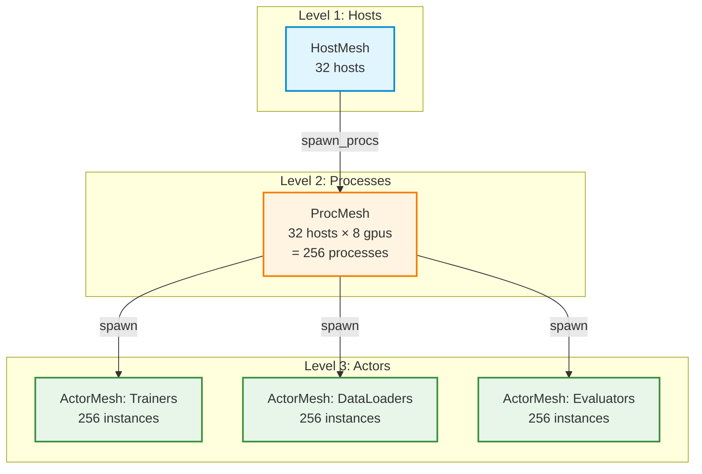

### Spawning Flow

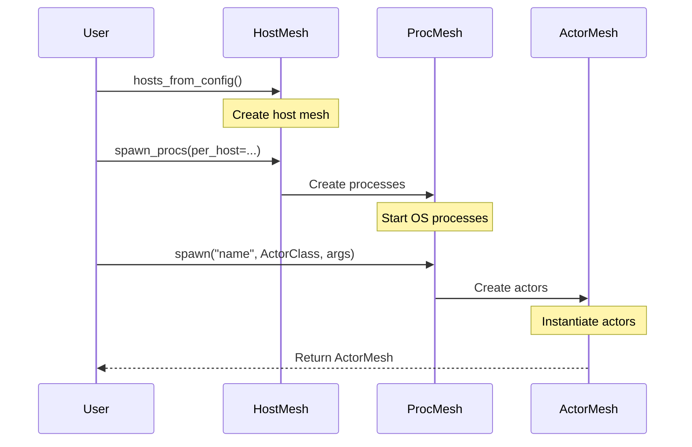

### Dimension Inheritance

```python
# Dimensions flow down the hierarchy

# HostMesh
hosts = hosts_from_config("MONARCH_HOSTS")
# extent: {"hosts": 32}

# ProcMesh inherits and adds
procs = hosts.spawn_procs(per_host={"gpus": 8})
# extent: {"hosts": 32, "gpus": 8}

# ActorMesh inherits exactly
trainers = procs.spawn("trainers", Trainer)
# extent: {"hosts": 32, "gpus": 8}

dataloaders = procs.spawn("dataloaders", DataLoader)
# extent: {"hosts": 32, "gpus": 8}
```

**Dimension Flow Diagram:**

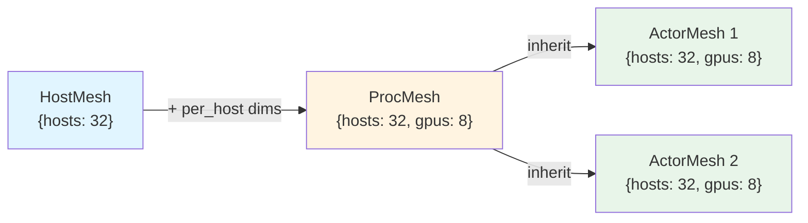

---

## Mesh Operations

### 1. Slicing

Slicing allows selecting subsets of a mesh along dimensions.

#### Single Index Slicing

```python
actors = procs.spawn("actors", MyActor)
# extent: {"hosts": 32, "gpus": 8}

# Select specific GPU
first_gpu = actors.slice(gpus=0)
# extent: {"hosts": 32, "gpus": 1}

# Select specific host
first_host = actors.slice(hosts=0)
# extent: {"hosts": 1, "gpus": 8}

# Select specific point
specific = actors.slice(hosts=5, gpus=3)
# extent: {"hosts": 1, "gpus": 1}  (single actor)
```

#### Range Slicing

```python
# Python slice notation
first_four_gpus = actors.slice(gpus=slice(0, 4))
# extent: {"hosts": 32, "gpus": 4}

# First two hosts
first_two_hosts = actors.slice(hosts=slice(0, 2))
# extent: {"hosts": 2, "gpus": 8}

# Combined
subset = actors.slice(hosts=slice(0, 2), gpus=slice(0, 4))
# extent: {"hosts": 2, "gpus": 4}
```

#### Slicing Visualization

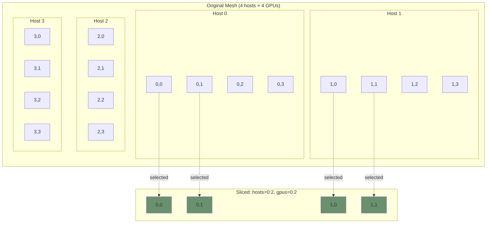

### 2. Broadcasting

Sending messages to all elements in a mesh.

```python
# Broadcast to entire mesh
actors.method.call(args).get()

# Broadcast to slice
actors.slice(gpus=slice(0, 4)).method.call(args).get()

# Fire-and-forget broadcast
actors.method.broadcast(args)
```

**Broadcast Flow:**

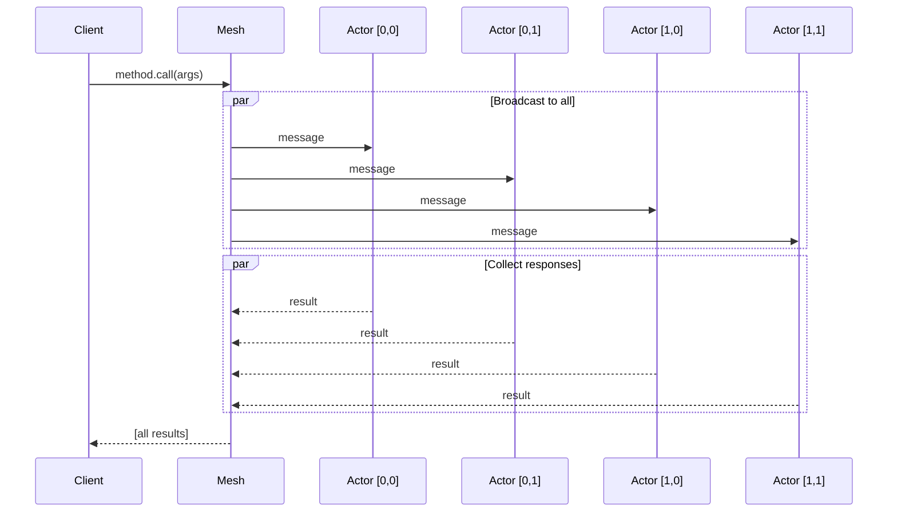

### 3. Point-to-Point Selection

```python
# Get single actor
actor = actors.slice(hosts=0, gpus=0)

# Call single actor
result = actor.method.call_one(args).get()

# Use in actor initialization
class Client(Actor):
    def __init__(self, servers: ActorMesh):
        # Get corresponding server for my rank
        rank = context().actor_instance.rank
        self.server = servers.slice(**rank)
```

### 4. Extent and Shape

```python
# Get mesh extent
print(actors.extent)
# Output: {"hosts": 32, "gpus": 8}

# Get total size
total = 1
for size in actors.extent.values():
    total *= size
print(f"Total actors: {total}")  # 256

# Check dimensions
if "gpus" in actors.extent:
    num_gpus = actors.extent["gpus"]
```

---

## Distributed Patterns

### Pattern 1: Simple Data Parallel

All actors process different data independently.

```python
class Trainer(Actor):
    @endpoint
    def train_step(self, global_step: int):
        # Each actor has its own data
        batch = self.get_local_batch()
        loss = self.model(batch)
        return loss

# All actors train in parallel
trainers = procs.spawn("trainers", Trainer)
losses = trainers.train_step.call(step=0).get()
print(f"Average loss: {sum(losses) / len(losses)}")
```

**Pattern Diagram:**

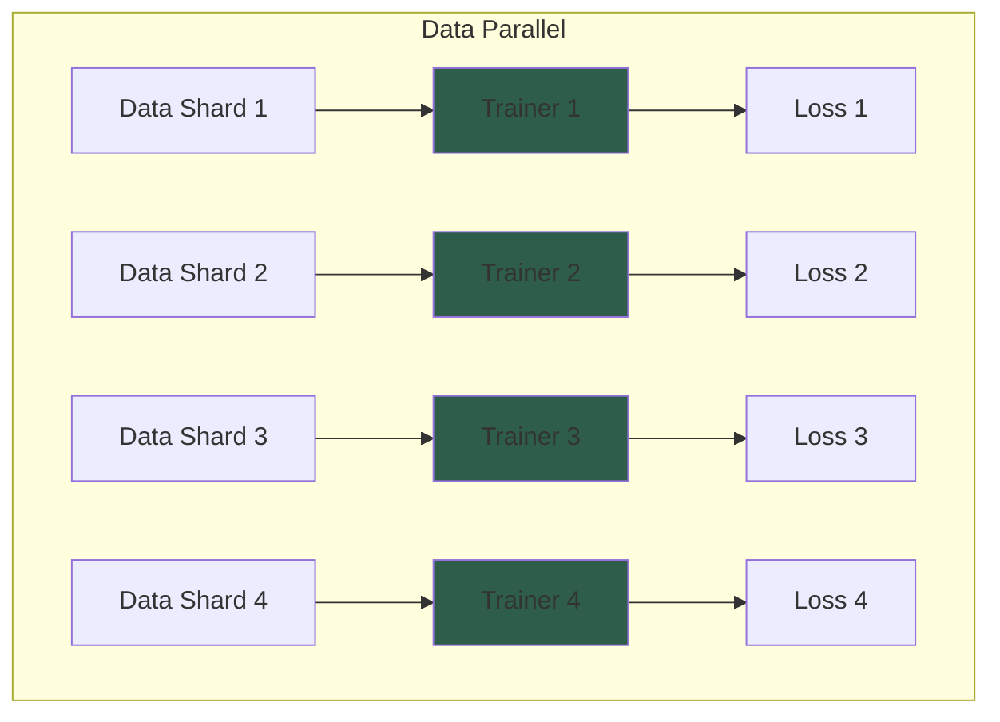

### Pattern 2: Parameter Server

Central server stores parameters, workers pull and push.

```python
class ParameterServer(Actor):
    def __init__(self):
        self.params = {}

    @endpoint
    def get_params(self):
        return self.params

    @endpoint
    def update_params(self, gradients):
        # Apply gradients
        for k, grad in gradients.items():
            self.params[k] -= 0.01 * grad

class Worker(Actor):
    def __init__(self, ps: ParameterServer):
        # Each worker connects to PS
        self.ps = ps.slice(gpus=0)  # Single PS

    @endpoint
    def train_step(self):
        # Pull params
        params = self.ps.get_params.call_one().get()

        # Train
        gradients = self.compute_gradients(params)

        # Push gradients
        self.ps.update_params.call_one(gradients)

# 1 parameter server
ps_proc = this_host().spawn_procs(per_host={"gpus": 1})
ps = ps_proc.spawn("ps", ParameterServer)

# 8 workers
worker_procs = this_host().spawn_procs(per_host={"gpus": 8})
workers = worker_procs.spawn("workers", Worker, ps)

# Train
workers.train_step.call()
```

**Parameter Server Diagram:**

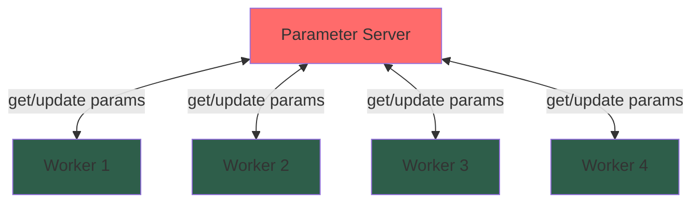

### Pattern 3: Pipeline Parallel

Stages process data sequentially.

```python
class Stage1(Actor):
    @endpoint
    def forward(self, input):
        return self.layer1(input)

class Stage2(Actor):
    def __init__(self, stage1: Stage1):
        rank = context().actor_instance.rank
        self.prev_stage = stage1.slice(**rank)

    @endpoint
    def forward(self, input):
        # Get output from previous stage
        x = self.prev_stage.forward.call_one(input).get()
        return self.layer2(x)

class Stage3(Actor):
    def __init__(self, stage2: Stage2):
        rank = context().actor_instance.rank
        self.prev_stage = stage2.slice(**rank)

    @endpoint
    def forward(self, input):
        x = self.prev_stage.forward.call_one(input).get()
        return self.layer3(x)

# Create pipeline
stage1 = procs.spawn("stage1", Stage1)
stage2 = procs.spawn("stage2", Stage2, stage1)
stage3 = procs.spawn("stage3", Stage3, stage2)

# Run pipeline
results = stage3.forward.call(input_data).get()
```

**Pipeline Diagram:**

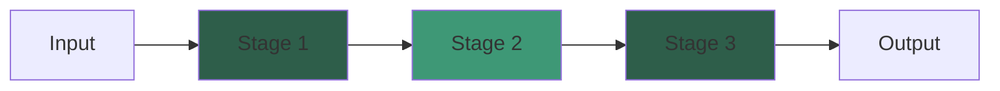

### Pattern 4: Hierarchical Communication

Groups communicate internally, then aggregate.

```python
class Worker(Actor):
    @endpoint
    def compute(self):
        return self.local_result

class GroupLeader(Actor):
    def __init__(self, workers: ActorMesh):
        # Get workers in my group
        rank = context().actor_instance.rank
        self.workers = workers.slice(hosts=rank["hosts"])

    @endpoint
    def aggregate(self):
        # Collect from workers in group
        results = self.workers.compute.call().get()
        return sum(results) / len(results)

# Workers on all GPUs
workers = procs.spawn("workers", Worker)

# One leader per host
leader_procs = hosts.spawn_procs(per_host={"gpus": 1})
leaders = leader_procs.spawn("leaders", GroupLeader, workers)

# Two-level aggregation
group_results = leaders.aggregate.call().get()
final_result = sum(group_results) / len(group_results)
```

**Hierarchical Diagram:**

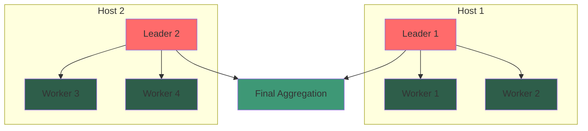

---

## Best Practices

### 1. Mesh Design

✅ **DO:**
- Use semantic dimension names ("hosts", "gpus", "workers")
- Keep meshes aligned when actors communicate
- Document mesh extent expectations
- Use consistent naming across codebase

❌ **DON'T:**
- Use generic names ("dim1", "dim2")
- Create mismatched meshes for communicating actors
- Hardcode extent values
- Mix different mesh organizations

```python
# ✅ Good: Clear, semantic names
procs = hosts.spawn_procs(per_host={"gpus": 8})
trainers = procs.spawn("trainers", Trainer)
dataloaders = procs.spawn("dataloaders", DataLoader)
# Both have same extent: {"hosts": N, "gpus": 8}

# ❌ Bad: Mismatched meshes
procs1 = hosts.spawn_procs(per_host={"gpus": 8})
procs2 = hosts.spawn_procs(per_host={"workers": 16})
trainers = procs1.spawn("trainers", Trainer)
dataloaders = procs2.spawn("dataloaders", DataLoader)
# Different extents - hard to coordinate!
```

### 2. Slicing Patterns

```python
# ✅ Use slicing for subset operations
first_rank = actors.slice(gpus=0)
subset = actors.slice(gpus=slice(0, 4))

# ✅ Use rank-based selection in actors
class Worker(Actor):
    def __init__(self, servers: ActorMesh):
        rank = context().actor_instance.rank
        self.server = servers.slice(**rank)

# ❌ Don't manually track indices
class BadWorker(Actor):
    def __init__(self, servers: list):
        self.server_idx = compute_index()  # Error-prone!
        self.server = servers[self.server_idx]
```

### 3. Dimension Naming

```python
# ✅ Good: Descriptive names
{
    "hosts": 32,
    "gpus_per_host": 8,
    "replicas": 4
}

# ✅ Good: Standard names
{
    "hosts": 32,
    "gpus": 8
}

# ❌ Bad: Ambiguous
{
    "dim1": 32,
    "dim2": 8
}

# ❌ Bad: Confusing
{
    "x": 32,
    "y": 8
}
```

### 4. Extent Validation

```python
class MyActor(Actor):
    @endpoint
    def validate_mesh(self, other_actors: ActorMesh):
        # ✅ Validate extent matches
        my_extent = context().actor_instance.mesh_extent
        other_extent = other_actors.extent

        if my_extent != other_extent:
            raise ValueError(
                f"Mesh extent mismatch: {my_extent} != {other_extent}"
            )
```

### 5. Resource Management

```python
# ✅ Clean shutdown
def cleanup():
    # Stop actors gracefully
    actors.shutdown.broadcast()

    # Wait for completion
    time.sleep(1)

    # Clean up processes
    procs.terminate()

# ✅ Handle failures
try:
    result = actors.compute.call().get()
except MeshFailure as e:
    print(f"Mesh failure: {e}")
    # Handle recovery
```

### 6. Testing Meshes

```python
import pytest
from monarch.actor import this_host

@pytest.fixture
def test_mesh():
    # Create small mesh for testing
    procs = this_host().spawn_procs(per_host={"gpus": 2})
    yield procs
    # Cleanup
    procs.terminate()

def test_broadcast(test_mesh):
    actors = test_mesh.spawn("test", TestActor)
    results = actors.test_method.call(42).get()
    assert len(results) == 2
    assert all(r == 42 for r in results)

def test_slicing(test_mesh):
    actors = test_mesh.spawn("test", TestActor)

    # Test single slice
    single = actors.slice(gpus=0)
    result = single.test_method.call_one(10).get()
    assert result == 10
```

---

## Summary

### Key Takeaways

1. **Three Mesh Types**: HostMesh → ProcMesh → ActorMesh
2. **Hierarchical**: Meshes spawn other meshes
3. **Multidimensional**: Named dimensions with extents
4. **Sliceable**: Select subsets along dimensions
5. **Broadcast-capable**: Send to all or subset
6. **Dimension Inheritance**: Child meshes inherit parent dimensions

### Mesh Type Comparison

| Feature | HostMesh | ProcMesh | ActorMesh |
|---------|----------|----------|-----------|
| **Contains** | Hosts/Machines | OS Processes | Actor Instances |
| **Spawns** | ProcMesh | ActorMesh | Nothing |
| **Dimensions** | Host-level | Host + Process | Inherited |
| **Messaging** | No | Limited | Full |
| **Slicing** | Yes | Yes | Yes |
| **Activation** | No | Yes (tensors) | No |

### Hierarchy Recap

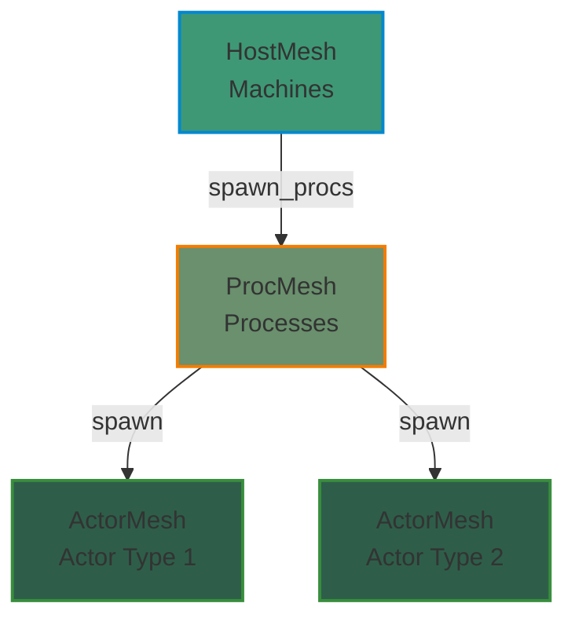

---

## Quick Reference Card

### Creating Meshes

```python
# HostMesh
hosts = hosts_from_config("MONARCH_HOSTS")
host = this_host()

# ProcMesh
procs = hosts.spawn_procs(per_host={"gpus": 8})

# ActorMesh
actors = procs.spawn("actors", MyActor, args)
```

### Slicing

```python
# Single index
actor = actors.slice(gpus=0)

# Range
subset = actors.slice(gpus=slice(0, 4))

# Multiple dimensions
region = actors.slice(hosts=1, gpus=slice(0, 2))
```

### Messaging

```python
# Call all and collect
results = actors.method.call(args).get()

# Call one
result = actor.method.call_one(args).get()

# Broadcast (no wait)
actors.method.broadcast(args)
```

### Common Patterns

```python
# Get corresponding actor in __init__
class MyActor(Actor):
    def __init__(self, others: ActorMesh):
        rank = context().actor_instance.rank
        self.other = others.slice(**rank)

# Validate extent
assert actors.extent == expected_extent

# Get total size
total = prod(actors.extent.values())
```


<!-- ### Next Steps

- Read [Actor Concepts](./ACTORS.md) for actor details
- Review [Overview](./MONARCH_OVERVIEW.md) for system architecture
- Explore [Examples](../examples/) for patterns
- Check [API Reference](./api/) for complete API -->
