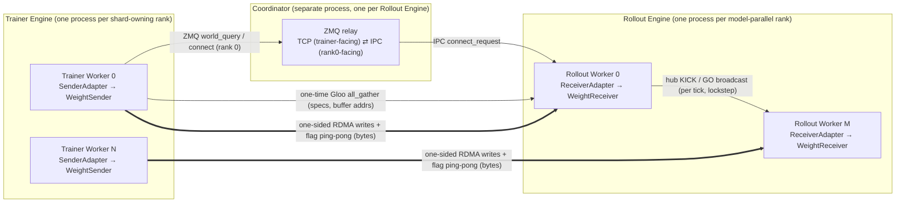

# Architecture

WeightBridge moves updated policy weights from **Trainer Workers** (the training runtime) to
**Rollout Workers** (the inference/generation runtime) when the two sides use different parameter
names, tensor layouts, or parallelism. It is organized as three planes:

- **Control Plane** — establishes the connection and keeps rollout ranks in lockstep. ZMQ plus the
  CPU-resident data-ready sequence flags that trigger each update.
- **Metadata Plane** — describes *how* each runtime's local tensors map to a common coordinate
  system (the HuggingFace checkpoint), and computes who must send which bytes to whom. Gloo,
  used once at connect.
- **Data Plane** — moves the bytes. One-sided RDMA writes across nodes, with direct CUDA IPC for
  supported same-node paths.

Weight bytes never travel over the Control or Metadata planes; those planes only carry small
JSON/metadata messages. The Data Plane is a passive, one-sided design: the receiver never issues a
collective to pull weights — the sender *writes* into the receiver's registered memory and flips a
flag the receiver polls. This is the central design choice (see [Threading model](#threading-model)).



The system **connects once** and then **streams many updates**. Every buffer, process group, and RDMA
registration is created at connect and reused for every subsequent update; per-update work is just
pack → write → flag → consume.

---

## Control Plane (flags + ZMQ lockstep)

Each Rollout Engine runs one standalone **coordinator process** — a thin ZMQ relay with no torch and
no HTTP. It binds a trainer-facing TCP `ROUTER` and a rank0-facing IPC `ROUTER`. Trainer rank 0 uses it
for `world_query` and the one-time `connect`; per-update notification normally comes from the sender's
data-before-flag sequence itself. The old `receive` relay remains only as a fallback when an engine rank 0
has no trainer input and therefore cannot observe a data flag.

Endpoints are **derived deterministically** from a single per-engine integer (in practice the
inference server's port), so every process — the coordinator, all Rollout Workers, and the trainer —
computes the same addresses with no handshake or environment handoff:

- coordinator IPC (rank0-facing): `coordinator_ipc(port)`
- coordinator TCP (trainer-facing): `coordinator_tcp_port(port)`
- rank0 ⇄ peers hub: `hub_addr(port)`

Inside a Rollout Engine, rank 0 owns a **hub** (a ZMQ star) to the other model-parallel ranks. Every
scheduler tick, rank 0 turns its local input flag state into one decision and **broadcasts it to all
peers, which block for it**. RS uses two decisions: KICK wakes CPU receive workers without stopping
generation; GO quiesces every TP rank after rank 0's first GPU ingress round is ready. This per-tick
lockstep keeps all model-parallel ranks entering blocking steps together — see
[Threading model](#threading-model).

After GO, a peer may still be waiting for its own GPU ingress flag. There is no engine-wide exchange
barrier: each rank starts external exchange after its own A+R. Before reusing a peer's parity-selected
`grecv` destination it waits only for that peer's OFFLOAD generation from `D` rounds ago. OFFLOAD means the
target completed GRECV→DOFF, not that downstream readers finished. Each external DATA flag is published as
soon as that peer's individual bulk write completes, so one slow destination cannot hold back every peer.

The fused same-node process is called **internal consume**. Each receiver owns a non-RDMA DOFF arena with a
fixed depth (default one): every generation contains one SEND/PREP shadow plus one exclusive, maximum-sized
region for each possible external source. There is no common chunk pool, so substantially different receive
sizes do not fragment or contend for an allocation. After A+R, SEND is copied to the self DOFF region. After
external DATA, GRECV is copied to that source's DOFF region and OFFLOAD immediately frees GRECV.

The exchange/consume host worker scans every `(column owner, source, DOFF slot)` shared-memory READY sequence
and dispatches whichever lanes are ready. A peer descriptor kernel reads the owner's DOFF CUDA-IPC mapping
over NVLink and writes the corresponding model slices directly. DONE from the self kernel and every local
reader releases only the DOFF slot. Thus reader stragglers may delay reuse at depth one, but cannot extend the
registered GRECV lifetime after offload.

One endpoint-lifetime waiter per external destination publishes completed writes in sequence; a cross-round
dispatcher keeps both registered parities live. At depth 2, round `r+1` writes the other GRECV parity without
waiting for `r`, while `r+2` waits only for `r` OFFLOAD. DOFF reuse has its own cyclic predecessor at
`round % WBRIDGE_DOFF` and waits for local DONE. These two lifetimes are deliberately independent.

There is **no** `set_worker_num` and **no** HTTP route. Rank 0 auto-registers the engine's receiver
count with the coordinator at startup, and that is how the coordinator answers the trainer's
`world_query`.

## Metadata Plane (Gloo, once)

The Metadata Plane makes routing configuration-agnostic. It answers: *given my local sharded
parameters and yours, which byte ranges do I need to send you?*

- **`LoadSpec`** records how HuggingFace checkpoint tensors map into a runtime's local worker tensors.
  It can represent the transformations mainstream loaders perform: QKV merge, gate/up merge,
  row/column-parallel slices, vocab slices, expert stacking, and transpose.
- WeightBridge **infers** a `LoadSpec` by *symbolically probing the runtime's own `load_weights`
  function* (see [`specgen`](api.md#metadata-helpers)): it feeds structured index-placeholder tensors
  through the loader, observes which worker elements they land in, and recovers axis-aligned shard
  boxes. This relies on `load_weights` being a **pure, bijective copy/scatter** for same-dtype
  elements — no arithmetic on values (see [limitations](limitations.md#loadspec-inference)).
- **`ShardSpec`** is the storage-free view derived from `LoadSpec`: which HF-coordinate regions a
  process owns (sender) or needs (receiver).

At connect, all ranks `all_gather_object` their `ShardSpec`s, dtypes, and registered buffer addresses
over a **one-time Gloo group**. The `WeightRouter` then compares sender and receiver `ShardSpec`s,
computes overlaps, and schedules balanced **communication rounds** under a per-rank byte cap. The Gloo
group carries only this metadata — never weights — and is created without eager device binding to
avoid deadlocking against the many communicators an inference/training runtime already holds.

## Data Plane (one-sided RDMA)

The Data Plane is a staged pipeline whose only cross-node bulk primitive is a one-sided RDMA **write**:

```text
Pack(translate) → RDMA write → Fused prepare → External exchange → Internal consume(translate)
```

- **Pack** copies live trainer parameters into a wire buffer laid out in HF coordinates, applying the
  sender `LoadSpec` in reverse (worker → HF). Packing runs as a fused, transpose-aware `CopyPlan` in
  O(1) kernel launches.
- **RDMA write** transfers the wire buffer directly into the receiver's registered arena. There is no
  send/recv and no notify: "done" and "consumed" are themselves tiny **flag** writes the peer polls.
- **Fused prepare / external exchange** prepares each receiver's local de-duplicated column. One copy plan maps RECV
  directly into canonical `own` plus any unique partial peer payloads; full peer payloads alias `own`,
  so there is no assemble-then-repack intermediate. Cross-node columns land once in exact compact GRECV
  slots (see [de-duplication](#de-duplication)).
- **Internal consume** applies the receiver `LoadSpec` (HF → worker) while reading self or peer DOFF bytes
  directly into live rollout parameters. One descriptor kernel per independently-ready owner/source slot
  fuses NVLink transfer, transpose/reshard, and consume.

Transport selection is per destination, and is the same whichever RDMA backend is in use:

- **same-node** device→device bulk → direct CUDA-IPC access over NVLink that bypasses the RDMA engine.
  Trainer→rollout still uses a peer copy. Receiver internal consume opens the owner's DOFF allocation in the consumer
  GPU's address space and issues ordinary kernel loads from that mapped address, gated by an exported CUDA
  event so data and its completion signal share one GPU ordering domain.
- **cross-node** bulk → the RDMA engine over the fabric (the "bulk" NIC),
- **cross-node and trainer/rollout flags** (tiny writes) → the RDMA engine; a separate NIC when staging,
  so a saturating bulk write never starves the concurrent flag handshake.
- **same-node replica READY/DONE sequences** → a node-local shared CPU bank. The ready sequence only
  establishes that the producer recorded this generation; the imported CUDA event remains the GPU
  visibility fence before a peer pulls the bytes.

### Transport backends

The transport is pluggable behind one small ABC, `RdmaEngine` (`backend/rdma/base.py`):
`init` / `register` / `write` / `write_async` / `write_batch` / `wait` / `close`. Everything above that
line — routing, dedup, arena management, the flag protocol — is backend-agnostic. `SenderArgs.protocol`
picks the implementation at connect, and the choice travels to the receivers in the connect payload so
both sides always agree.

| `protocol` | engine | |
|---|---|---|
| `"efa"` | `DualMooncakeEngine` | default; Mooncake over EFA, plus `nvlink_intra` for same-node pairs |
| `"tcp"` | `DualMooncakeEngine` (`MC_FORCE_TCP=1`) | local/toy runs, no RDMA fabric required |
| `"monarch"` | `MonarchEngine` | one-sided libibverbs via [Monarch](https://github.com/meta-pytorch/monarch); the workers must themselves be Monarch actors |

(`LocalStagingEngine` is not selectable — it is the in-process GPU↔CPU engine that a staging endpoint
runs *alongside* its network engine.)

**Mooncake.** Its intra-node transport (`nvlink_intra`, in `DualMooncakeEngine`) is the fallback for
same-node pairs the IPC bypass cannot cover: a staging endpoint (host DRAM is not IPC-mappable) or an
allocator that cannot export IPC handles (`expandable_segments`). A Mooncake wheel without that
transport is not fatal — those writes take the configured Mooncake network transport instead. Because
EFA round-robins **one NIC per transfer
request**, each large write is **striped** into configured contiguous sub-transfers in one batch, so a
single write fans out across all NICs. This turns a single-path transfer into a full-fabric transfer.
(Native Mooncake RC-QP RDMA does *not* work on EFA; the EFA build is required — see
[limitations](limitations.md#3-mooncake-on-efa).)

**Monarch.** Addressing is the one real impedance mismatch. A Monarch `RDMABuffer` has **no remote
offset** — a write always lands at the buffer's base — while the ABC writes to arbitrary remote
addresses. But every region WeightBridge ever writes into is fixed and enumerable at connect
(per-`(sender, round)` RECV slots, flag slots, per-peer `grecv` slots), so the owner publishes **one
buffer per exact `(addr, size)` region** through the optional `publish_regions` hook and the writer looks
the region up. Publisher and writer tile regions through the same deterministic function
(`WBRIDGE_MONARCH_CHUNK_BYTES`, default 64 MiB) so lookups match exactly; tiling is what makes an offset
addressable at all, and the tile size is only a tuning knob — it trades connect time (fewer published
handles) against nothing measurable in steady state. Monarch binds **one NIC per GPU** by design (device
memory takes the NIC co-located with its GPU), so it has no equivalent of Mooncake's sub-slicing: at
equal NIC count it is moderately *faster* than Mooncake, and slower once Mooncake stripes across the
fabric. Its constraints on the surrounding process are sharp enough to have their own
[pitfall section](limitations.md#4-monarch-transport).

**Peer-progressive sender bulk.** A receiver's exact prior parity slot is the dependency for a trainer
write—not the slowest slot among every receiver touched by that round. The Stage-2 sender therefore scans
the pinned ACK words without blocking, calls `write_async` as soon as each destination becomes eligible,
and hands the resulting handle to one endpoint-lifetime waiter for that destination. That waiter publishes
DATA-ready immediately after its own completion. This removes both round-level head-of-line barriers:
another receiver's late ACK cannot postpone submission, and another transfer's late completion cannot
postpone DATA-ready. Exact `rdma_peer_<receiver-rank>` Gantt records span the sender's real submission
timestamp through observed completion, so receiver timelines do not infer ingress start from a local poll.

`write_batch` remains in the backend API for callers whose whole fan-out genuinely shares a dependency and
completion boundary. That distinction matters for Monarch: coalescing destinations into one action
materially improved its slowest-rank throughput in the ladder benchmark. WeightSender intentionally gives
up that cross-destination completion boundary because it cannot both fuse the action and publish a truthful
per-destination DATA-ready flag. The control plane likewise uses one `write_async` per flag.

### De-duplication

When trainer or rollout parallelism replicates a tensor across ranks, naive routing sends the same
bytes many times. WeightBridge deduplicates:

- **Senders** send only a disjoint sub-slice of any tensor replicated across senders (the receiver
  reconstructs by union — no sender-side coordination needed).
- **Receivers** in an `m`-member replica class each receive only their `1/m` per-tensor slice, then
  reconstruct the full shard with a per-tensor receiver↔receiver all-to-all over a single packed
  **arena**. Its `D` parity slots contain only RECV and fused-prepare (`own`/`send`) bytes. A compact
  `grecv` bank sits after those slots and contains one parity slot per active exact cross-node ingress column. Same-node
  columns are internally consumed from their owners and allocate no destination slot. Per-source consumed
  flags prevent an external writer from overwriting a slot still read by any local kernel, including the
  epoch boundary via a cyclic final-round → first-use dependency. The generic non-topology fallback retains
  its full peer-partitioned GRECV bank.

Dedup is keyed on canonical, deterministically-sorted shard identities so every rank independently
agrees on which sub-shard is whose — required because the flag ping-pong is lockstep per pair.

**Group consolidation (`WBRIDGE_DEDUP_PAIR_BYTES`).** A *small* tensor replicated *widely*
(norms, MoE gates held on every rank) becomes a wide all-gather that costs many per-pair flag handshakes
while saving almost no RDMA. A deterministic planning-layer pass scans the exchange plan and, for any
receiver pair whose crossing traffic is below a threshold (`WBRIDGE_DEDUP_PAIR_BYTES`, default `inf`),
decomposes that wide class into a *partition* of smaller sub-groups — each either an existing smaller
group it can piggyback on (whose sync edges are already paid) or a singleton (a direct full send from the
trainer, no exchange). It only rewrites the per-tensor grouping; the arena, exchange, and consume machinery
are unchanged, so it stays byte-exact. On the representative multi-engine run this collapsed most of each
receiver's distinct exchange peers (the widely-replicated tensors fold onto existing cross-engine pairs)
for negligible additional sender RDMA, materially reducing transfer time at high round counts. Aggressive consolidation
is the library default because it also gives topology-aware exchange one uniform group per
worker; set the threshold to `0` to retain the natural replica classes.

## Threading model

This is the crux of a correct integration, so it is worth stating precisely.

- The **receiver is an in-process object living inside each Rollout Worker process** — one per
  model-parallel rank — **not** a separate process. The only separate process is the coordinator.
- **Readiness decisions and weight consumption run on the Rollout Worker's main (scheduler) thread**,
  synchronously, inside `poll_requests()`. Every tick, rank 0 non-blockingly peeks
  its CPU-resident first-round sequence, decides, and broadcasts over the hub; every peer observes the
  same decision. The coordinator intake thread remains for connect and the zero-input fallback.
- This **per-tick, rank0-broadcast lockstep is mandatory**: it guarantees all model-parallel ranks
  enter any blocking step together. A decentralized, per-rank, self-scheduled receiver deadlocks —
  one rank enters WeightBridge's step while another is still inside the inference runtime's *own* TP/EP
  collective, and two communicators get entered in opposite order across ranks (a silent circular
  wait). The one-sided data plane exists for the same reason: the receiver is a passive RDMA *target*
  and never issues a collective to fetch weights.
- On the receiver, prepare runs in round order, while the topology-aware 3-stage dispatcher keeps both
  registered parities active. An exact cyclic OFFLOAD protects each GRECV parity; an independent READY/DONE
  generation protects each DOFF slot. Same-parity prepare waits only for outbound RDMA reads and its own
  SEND→DOFF copy, not internal readers. The fixed-DOFF topology path requires 3-stage dispatch.
- The **sender** runs its RDMA on a persistent background daemon thread, so `send_weights()` returns
  after packing while the transfer overlaps the next training step.
- Optional CPU **staging** (sender or receiver) adds background threads that offload/land bytes through
  host memory; it trades bandwidth for HBM headroom and is off by default. With receiver staging, the
  first CPU-landed round triggers KICK, the worker receives the complete epoch without stopping SGLang,
  and only then preloads the first GPU ingress round and publishes the host-side flag that triggers GO.

## Latency tuning (enabled by default)

The wire is chunked into **rounds** under a per-rank byte cap (`WBRIDGE_ROUND_CAP_BYTES`): fewer, larger
rounds saturate the fabric better and pay less per-round overhead, but need a larger arena. At a fixed
(small) cap the round count is high, and a depth-1 receiver pays, *per round*, a full
sender↔receiver round-trip (the sender waits on the receiver's ack before writing the next round) plus a
serial control-plane handshake. The default library configuration combines the two scheduling features with
direct asynchronous flag publication:

- **Depth-2 RECV pipeline (`WBRIDGE_RECV_PIPELINE=1`).** Two RECV/SEND/GRECV parity slots let the sender
  **stream two rounds ahead** instead of blocking on each ack, removing the backpressure round-trip that
  dominates the per-round wait. External round `r+1` uses the other GRECV parity immediately; only round
  `r+2` waits for round `r` OFFLOAD.
- **Topology-aware three-stage receive (`WBRIDGE_TOPO_EXCHANGE=1`, `WBRIDGE_RECV_3STAGE=1`).** Cross-node
  exchange is reduced to one worker per node; a cross-round worker overlaps independently-gated external
  exchange + internal consume with landing and fused prepare in the opposite parity slot.
- **Direct asynchronous flags.** ACK, DATA, and OFFLOAD each reserve an exclusive
  `(kind, peer, round)` CPU word for the whole transfer epoch. The producing sender/waiter submits
  `write_async` immediately and does not wait for its completion, so there is no unified queue, slot-reuse
  fence, or publisher-thread head-of-line blocking. A daemon only retires already-submitted transport
  handles and reports failures off the protocol path. Persistent per-destination bulk waiters await disjoint
  handles concurrently and submit DATA immediately after their own completion, preserving
  data-before-flag ordering without coupling peers.

These mechanisms attack the same per-round control/latency overhead as
[group consolidation](#de-duplication), so they are partly **substitutes** for latency, although
consolidation can also change which topology-aware exchange groups are formed. Depth-2, three-stage
topology-aware exchange, and aggressive consolidation are configurable and on by default; direct
asynchronous flag publication is the control-plane implementation.

See [integration.md](integration.md) for the exact call sequence and the constraints these impose on a
host framework, [environment.md](environment.md) for the exact defaults and switch dependencies, and
[limitations.md](limitations.md) for the failure modes if they are violated.
