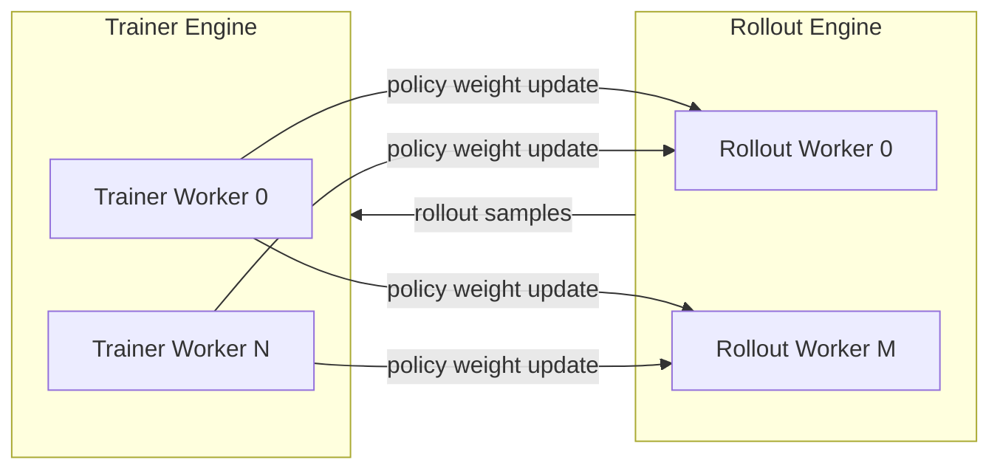
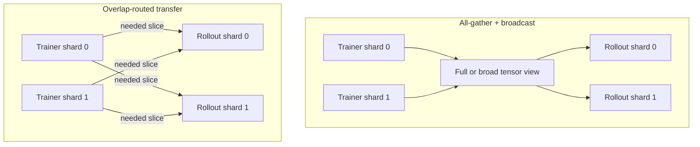

# Motivation

WeightBridge is an open source library for efficient, reusable weight transfer
between RL trainer runtimes and rollout or inference runtimes.

Modern RL systems often train a policy in one distributed runtime and serve
rollouts in another. The trainer may store parameters as Megatron-style
tensor-parallel shards, while rollout may expect SGLang, vLLM, or another
inference layout. Weight updates therefore need to solve two problems at once:
move bytes quickly, and translate between runtime-specific parameter layouts.

WeightBridge focuses on this boundary. It is not a complete RL framework,
scheduler, or inference engine. It provides the transfer layer that those systems
can reuse.

## Weight Transfer In RL

A typical RL pipeline has a Trainer Engine that updates policy weights and a
Rollout Engine that serves prompts, generates samples, and periodically refreshes
its model copy.

The update mode determines how directly weight transfer affects system
performance:

| Deployment mode | Policy mode | Is weight transfer on the critical path? | Why it matters |
| --- | --- | --- | --- |
| Collocated | On-policy | Yes | Rollout must use the latest policy, so training waits for weight update before generating the next batch. |
| Disaggregated sync | 1-off-policy | Yes | Trainer and rollout are separated, but each synchronized round still waits for the weight update boundary. |
| Disaggregated async | Unbounded off-policy | No, it can overlap with compute | Transfer can run while training or rollout continues, but slow updates increase policy staleness. |

The first two modes mainly turn weight-transfer latency into lower throughput.
The async mode can hide some transfer time behind compute, but it still cares
about update freshness: stale rollout weights affect scheduling, sample
distribution, and convergence.

## Existing Frameworks Leave A Gap

RL frameworks usually include a weight update mechanism, but it is often tied to
one runtime pairing, one execution mode, or one communication strategy.

| System / approach | Bandwidth optimal | Supports sync mode | Supports async mode | Hard-coded models | Hard-coded parallelism | Other limitations |
| --- | --- | --- | --- | --- | --- | --- |
| SLIME-style Megatron + SGLang integration | No, all-gather plus broadcast, GPU to GPU | Yes | No | Yes | No | Collocated/sync-oriented path; transfer logic is tied to the supported stack. |
| VeRL-style integrated runtime | No, all-gather plus broadcast, GPU to GPU | Yes | No | Yes | No | Default assumptions favor collocated sync execution rather than a reusable transfer layer. |
| AReaL-style sync systems | No, all-gather plus broadcast, GPU to GPU | Yes | No | Yes | No | Sync-oriented and framework-owned. |
| Async direct-write designs | No, usually all-gather plus broadcast into rollout GPUs | No | Yes | Yes | No | Can write rollout weights while inference is running, which risks correctness bugs. |
| StreamRL-style async systems | No, all-gather plus broadcast, GPU to GPU | No | Yes | Yes | No | Often requires additional GPU buffers for async update. |
| Laminar-style CPU-staged systems | No, all-gather plus broadcast through GPU-CPU-GPU paths | No | Yes | Yes | No | Requires each node's CPU memory to hold large weights and pays CPU staging cost. |
| P2P frameworks in production | Yes for the targeted layout | Usually one mode | Usually one mode | Yes | Yes | Efficient inside one production setup, but difficult to reuse when model, parallelism, or runtime pairing changes. |
| WeightBridge | Yes, routes shard overlaps | Yes | Yes | No | No | Focused on the weight-transfer layer; surrounding RL scheduling remains the framework's responsibility. |

These systems are valuable end-to-end RL stacks. The gap is that weight transfer
itself is rarely packaged as a layout-aware, mode-independent library. A team
that changes model family, tensor-parallel size, rollout engine, or sync/async
policy often has to rewrite framework-specific synchronization code.

## Performance: All-Gather And Broadcast Move Too Much

The common baseline is to reconstruct broad tensor views with all-gather and then
broadcast those views to rollout workers. This is easy to implement because it
uses standard collectives and existing save/load paths, but it sends much more
data than each destination actually needs.

The waste grows with parallelism:

- With TP8, a transfer that could be shard-routed can become roughly 8x larger.
- With EP256, expert weights can create roughly 256x avoidable traffic when each
  destination needs only a subset.
- With MoE and sparse models, total stored parameters grow quickly while
  activated parameters per token stay comparatively stable.

DeepSeek-style MoE scaling illustrates the trend. DeepSeek-V3 has
[671B total parameters and 37B activated parameters][deepseek-v3]. DeepSeek-V4-Pro
has [1.6T total parameters and 49B activated parameters][deepseek-v4-api]. In
other words, total stored parameters grow by about 2.4x, while activated
parameters grow by about 1.3x.

That ratio matters for RL weight update. Inference and training compute scale
more closely with activated parameters, but a naive weight update path moves
stored weights. DeepSeek-V4 also reports that, at 1M context, V4-Pro uses only
[27% of the single-token inference FLOPs and 10% of the KV cache][deepseek-v4-card]
compared with DeepSeek-V3.2. As model architectures make per-token compute more
efficient while resident weights keep growing, all-gather/broadcast can consume
a larger share of the time and bandwidth budget.

WeightBridge targets this mismatch directly: each receiver should get only the
logical tensor regions it needs.

## Flexibility: The Configuration Space Is Large

Performance alone is not enough. RL weight transfer also has to handle a large
configuration space:

- different trainer and rollout runtimes
- different parameter names
- different tensor-parallel or expert-parallel layouts
- different sharding sizes on the trainer and rollout sides
- merged tensors such as QKV or gate/up projections
- row-parallel, column-parallel, vocab, and expert shards
- collocated, disaggregated sync, and disaggregated async deployment modes

Many existing implementations hard-code two things:

- **Format translation**: model-specific rules for how trainer tensors map into
  rollout tensors.
- **Execution configuration**: sync-only, async-only, collocated-only, or
  runtime-pair-specific assumptions embedded into the update protocol.

That can be workable for one production configuration, but it is fragile for open
source users who want to mix frameworks, change sharding, or experiment with
policy freshness.

WeightBridge treats HuggingFace checkpoint tensors as a common logical coordinate
system. Each runtime describes how its local tensors relate to that coordinate
system, and WeightBridge computes the overlaps between sender and receiver
regions. The goal is to make the efficient path also the reusable path.

## What This Motivates

WeightBridge exists because RL weight transfer needs all of the following at the
same time:

- shard-level bandwidth efficiency instead of full-tensor broadcast
- reusable format translation instead of model-specific synchronization code
- one integration surface for collocated, disaggregated sync, and disaggregated
  async modes
- enough separation from the surrounding RL framework that trainers, rollout
  engines, and custom research systems can adopt only the transfer layer

The rest of the documentation describes how WeightBridge provides that layer:

- [Architecture](architecture.md) explains the Data Plane, Metadata Plane, and
  Control Plane.
- [Integration Guide](integration.md) shows how Trainer Workers and Rollout
  Workers call the adapter APIs.
- [API Reference](api.md) documents the public classes and helpers.
- [Examples](examples.md) is a runnable end-to-end walkthrough.
- [Limitations](limitations.md) documents current assumptions, caveats, and pitfalls.

## Non-Goals

WeightBridge intentionally keeps a narrow scope:

- It is not a full RL framework.
- It does not own rollout scheduling.
- It does not define the RL algorithm.
- It does not require trainer and rollout runtimes to share internal parameter
  names.
- It does not guarantee that every arbitrary loader transformation can be inferred
  without adapter support.

## Summary

Current RL frameworks often lack both the performance needed for the latest large
models and the flexibility needed for the broad RL configuration space. Many
systems rely on all-gather/broadcast, which wastes bandwidth, or embed
runtime-specific P2P logic that is hard to reuse.

WeightBridge turns weight update into a reusable library layer. It uses
parallelism-agnostic metadata and overlap routing so RL systems can avoid
unnecessary traffic without committing to one hard-coded model, sharding layout,
or update mode.

[deepseek-v3]: https://api-docs.deepseek.com/news/news1226
[deepseek-v4-api]: https://api-docs.deepseek.com/news/news260424
[deepseek-v4-card]: https://huggingface.co/deepseek-ai/DeepSeek-V4-Pro
